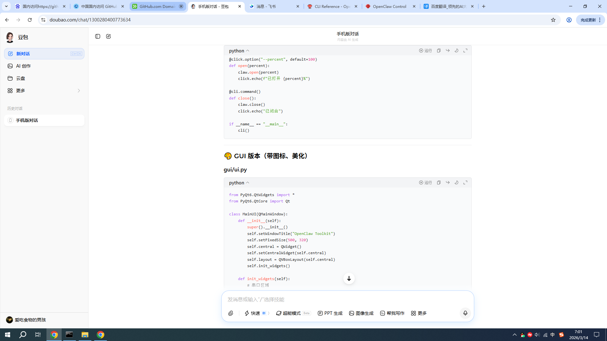

# OpenClaw Toolkit

[](LICENSE)
[](https://python.org)
[](https://github.com/ldg123/openclaw-toolkit/stargazers)

开源机械爪 & 舵机控制工具箱（CLI + GUI 双模式）

## 🎨 GUI 界面



## ✨ 功能特性

- 🔌 **串口自动扫描** - 支持多种波特率
- 🎯 **精确角度控制** - 0-180° 滑块调节 + 预设按钮
- ⚡ **快捷操作** - 全开/全闭/抓握/复位一键搞定
- 📊 **实时状态显示** - 连接状态、角度、日志
- 🎨 **现代化UI** - 渐变主题、圆角按钮、暗色日志
- 🔧 **CLI 模式** - 开发者友好
- 🖥️ **跨平台** - Windows / Linux / macOS

## 📦 安装

```bash
pip install -r requirements.txt
```

## 🚀 快速使用

### GUI 图形界面

```bash
python gui/window.py
# 或
python gui/main.py
```

### CLI 命令行

```bash
# 扫描串口
python cli/main.py scan

# 连接机械爪
python cli/main.py connect COM5

# 移动到指定角度
python cli/main.py move 90

# 打开爪
python cli/main.py open

# 关闭爪
python cli/main.py close

# 查看状态
python cli/main.py status COM5
```

## 📁 项目结构

```
openclaw-toolkit/
├── claw/              # 核心库
│   ├── core.py        # 控制器
│   ├── serial_utils.py # 串口工具
│   └── config.py      # 配置管理
├── cli/               # CLI 模块
├── gui/               # GUI 模块 (PyQt6)
├── screenshots/      # 截图
├── .github/workflows/# CI/CD 自动构建
└── README.md
```

## 🛠️ 技术栈

- Python 3.8+
- PyQt6 (GUI)
- pyserial (串口通信)
- click (CLI)

## 🤝 贡献

欢迎提交 Issue 和 PR！

## 📄 许可证

MIT License
